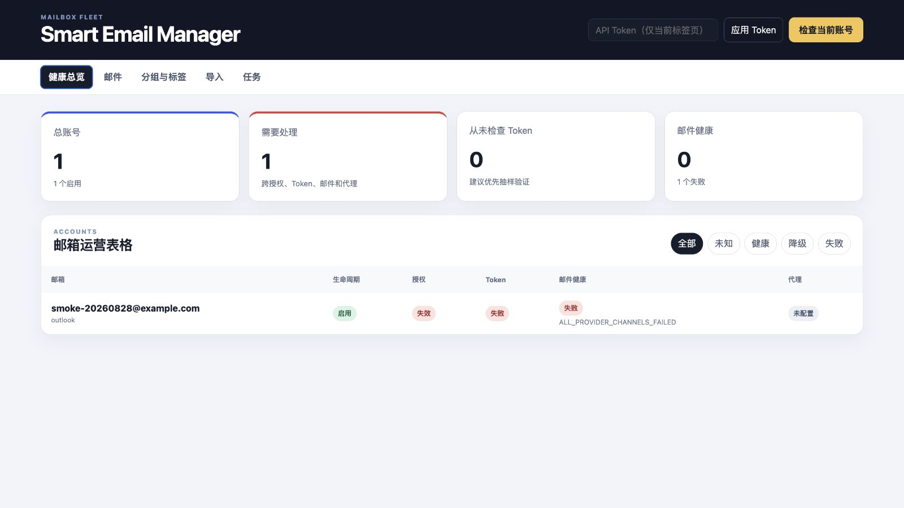

# Smart Email Manager

[](https://github.com/fanny7d/Smart-Email-Manager/actions/workflows/ci.yml)
[](https://github.com/fanny7d/Smart-Email-Manager/actions/workflows/security.yml)
[](https://www.python.org/)
[](LICENSE)

API-first mailbox fleet management platform built with FastAPI, PostgreSQL 18, React, and a Typer CLI.

The project is an Outlook-only public beta for operators and automation systems managing many
mailboxes. It includes:

- PostgreSQL-backed account, organization, health, retention and automation models
- 100+ versioned FastAPI operations under `/api/v1`
- persistent jobs, schedules and concurrent project leases backed by PostgreSQL
- built-in smart views, saved filters and single-use stable bulk-operation previews
- Microsoft Graph with Outlook OAuth IMAP fallback, plus SMTP forwarding
- first-class verification-code extraction across one mailbox or an Outlook fleet
- a CLI, React operations console and Manifest V3 extension sharing one OpenAPI contract



## Architecture

```text
React / CLI / Browser extension / automation
                    |
                    v
               FastAPI /api/v1
                 |        |
                 v        v
           PostgreSQL   enqueue Job
                            |
                            v
                     standalone Worker
                            |
                            v
                  Graph / IMAP / providers
```

See [docs/architecture.md](docs/architecture.md) for boundaries and migration rules.
Implementation and real-service acceptance are tracked in [docs/feature-matrix.md](docs/feature-matrix.md).

> Smart Email Manager is an independent open-source project and is not affiliated with or endorsed by
> Microsoft. Outlook and Microsoft Graph are trademarks of Microsoft Corporation.

## Local prerequisites

- Python 3.12–3.14 and `uv`
- PostgreSQL 18
- Node.js 24 and pnpm 11

## Quick start

```bash
createdb smart_email_manager_dev
cp .env.example .env
uv sync --all-groups --locked
uv run sem-migrate
uv run sem-api
```

In separate terminals:

```bash
uv run sem-worker
pnpm install --frozen-lockfile
pnpm --dir web dev
```

Useful checks:

```bash
uv run sem system health
uv run sem fleet summary
uv run sem accounts list --output json
uv run sem codes query --recent-minutes 30 --output json
uv run sem config validate --output json
uv run pytest
uv run ruff check .
pnpm --dir web build
```

The default API is `http://127.0.0.1:8000`; the React development server is `http://127.0.0.1:5173`.
Interactive API documentation is available at `http://127.0.0.1:8000/docs`.

## CLI configuration

Initialize the persistent CLI connection file and, for a token-protected deployment, store the token
in its separate mode-`0600` file:

```bash
uv run sem config init --api-url http://127.0.0.1:8000 --timeout 60
uv run sem config token-set
uv run sem config validate
```

See [docs/cli.md](docs/cli.md) for configuration precedence, automation examples and the isolated
`make cli-acceptance` gate. A safe example is committed as [sem.example.toml](sem.example.toml).

## API contract

FastAPI/Pydantic models are the implementation source for the contract. `uv run sem-openapi` writes the reviewed snapshot to `contracts/openapi.json`. React client generation and contract drift checks consume this file.

Every endpoint must have a stable explicit `operation_id`. The CLI must not import database or service modules.

## Safety defaults

- An empty `SEM_API_TOKEN` is accepted only in `development`.
- Development has a deterministic localhost-only fallback encryption key; set `SEM_MASTER_KEY` before
  importing anything you intend to keep, and production refuses to start without it.
- Production must use a least-privilege PostgreSQL role.
- Production secrets may be mounted with `SEM_API_TOKEN_FILE`, `SEM_MASTER_KEY_FILE` and `SEM_DATABASE_URL_FILE`; unreadable or empty files fail startup.
- Network calls never run inside long database transactions.
- Long-running operations belong to the PostgreSQL job system, not FastAPI `BackgroundTasks`.
- The runtime accepts Outlook accounts only. Removed temporary-mail, WebDAV, chat-notification and legacy-SQLite surfaces are not part of the API contract.

## Production

The production Compose stack and acceptance gates are documented in [deploy/README.md](deploy/README.md). API/Worker run as UID 10001, PostgreSQL migration and runtime roles are separated, and the Web container runs Nginx with a read-only root filesystem.

## Contributing and security

- Read [CONTRIBUTING.md](CONTRIBUTING.md) before opening a pull request.
- Ask usage questions through [GitHub Discussions](https://github.com/fanny7d/Smart-Email-Manager/discussions).
- Report vulnerabilities privately according to [SECURITY.md](SECURITY.md); never post credentials or
  mailbox content in a public issue.
- Changes are recorded in [CHANGELOG.md](CHANGELOG.md).

Smart Email Manager is released under the [MIT License](LICENSE).
